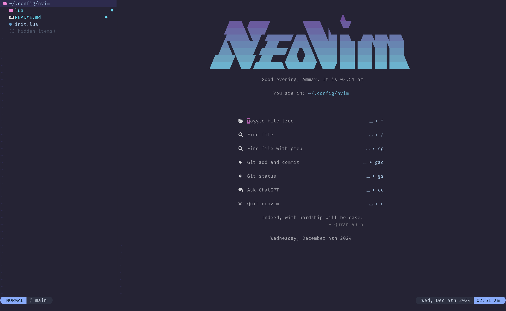

# ammar.nvim
<div align="center">
    
</div>
## Introduction
This repository contains my personalized setup for Neovim. Inspired by
[ThePrimeagen](https://www.youtube.com/watch?v=w7i4amO_zaE&t=1487s) and
[kickstart.nvim](https://github.com/nvim-lua/kickstart.nvim).

## Installation
### Install Neovim
Currently, I am using Neovim 0.10.2. It should likely work with all features up
to version 0.9 but not less.

### Install External Dependencies
External requirements:
- Basic utils: `git`, `make`, etc.
- ripgrep
- Language Setup
    + If you want to write TypeScript, need `npm`,
    + If you want to write Rust, need `cargo/rustup`,
    + etc.

### Install the configuration
Neovim's configuration's should be under the following paths based on your OS:
| **OS** | **PATH** |
| :----- | :------- |
| Linux, MacOS | `$XDG_CONFIG_HOME/nvim`, `~/.config/nvim` | 
| Windows (cmd) | `%localappdata%\nvim\` | 
| Windows (powershell) | `$env:LOCALAPPDATA\nvim\` |

#### Clone the configuration
<details><summary>Linux/MacOS</summary>

```bash
git clone https://github.com/ammar-ahmed22/nvim.git "${XDG_CONFIG_HOME:-$HOME/.config}"/nvim
```

</details>
<details><summary>Windows</summary>

If you are using `cmd.exe`:
```bash
git clone https://github.com/ammar-ahmed22/nvim.git "%localappdata$\nvim"
```

If you are using `powershell.exe`:
```bash
git clone https://github.com/ammar-ahmed22/nvim.git "${env:LOCALAPPDATA}\nvim"
```

</details>

#### Post install
Start neovim:
```bash
nvim
```

Install plugins with:
```bash
:PackerSync
```

> [!NOTE]  
> `:PackerSync` will likely remove the transparent background. Run `:lua
> SetColorScheme()` to remove it again (this only needs to be called after
> `:PackerSync`, opening a new session of `nvim` will do this automatically)


## Keymaps
Tabulated below is the list of keymaps that I have impelemented and what they are used for.

> [!NOTE]  
> Anywhere you see `⎵` it means space.

| **Keymap** | **Description** |
| :--------- | :-------------- | 
| `⎵ + h`| Return to [H]ome screen |
| `⎵ + f` | Open the file tree and focus on it |
| `⎵ + /` | Search for files in the current project, does not search `.gitignore`d files. |
| `⎵ + sw` | [S]earch for the [W]ord on the cursor in the files of the current project, does not search `.gitignored`d files. (Prompts you for the query) |
| `⎵ + sg` | [S]earch for a `[G]rep` query in the files of the current project, does not search `.gitignore`d files. |
| `⎵ + gs` | Show [G]it [S]tatus information |
| `⎵ + gac` | Runs `[G]it [A]dd and [C]ommit`(Prompts you for the add path, defaults to `.`, then prompts for the commit message) |
| `⎵ + gp` | Runs `[G]it [P]ush` |
| `⎵ + t`  | Starts a new [T]erminal in a horizontal split window, ready to run commands |
| `⎵ + cc` | Open [C]hatGPT [C]hat |
| `⎵ + n` | [N]ew File or Directory Prompt |
| `⎵ + e` | Move to the left window |
| `⎵ + r` | Move to the right window |
| `⎵ + w` | Cycle windows right to left |
| `⎵ + W` | Cycle windows left to right |
## Custom Commands
I have a defined a few of my own custom commands:

### Terminal Stuff
In neovim, there is a command called `:terminal` which opens up a terminal kind of like a text-editor with a special terminal mode. If you go into insert mode from terminal mode, you can now interact with your terminal as if you are in it. 

My problem was, I don't want it to take up the window I am working on, I want it to open a new window. So, I wrote my own custom commands, `:Term/:Terminal`.

It works that same as `:terminal`, however, the terminal window is a opened in a split horizontal window (below the current window).

I have also setup a neovim auto command that whenever any terminal is opened, it jumps to insert mode. So, as soon as I open the terminal, it is ready to use. This also allows for closing and exiting with `Enter` when a command is passed to `:terminal` (or `:Term/:Terminal`as well)

I have also setup a few keymaps for the terminal:
- `⎵ + t`: Opens a new terminal
- `<Esc>`: When in terminal mode, exits and closes the terminal
- `Ctrl + \\`: When in terminal mode, exits and closes the terminal (can't use `Ctrl+C` because that's used by the terminal)

### Running Common Commands
I find that I am typically running the same terminal command over and over. For example, working on a Rust project, I will continously run `cargo run` or for a python project I will continously run `python3 main.py`. For this reason, I set up a few custom commands:

#### `:R/:Run`
This command takes either 0 or 1 arguments. If it is run with 0 arguments, it checks if a `run_command` is set and runs that (prompting the user to confirm). If it is passed an argument, it runs that argument in the terminal.

#### `:SR/:SetRun`
This command takes 1 argument. Saves the passed argument as the `run_command`. If `:R` is called with no arguments, it runs this.

#### `:GR/:GetRun`
This command takes 0 arguments. Displays the saved `run_command` or helpful message if there is none.

### Creating files/Directories
With nvim-tree, it became a little eaiser to create files as I could just press `a` on the tree and it would prompt me to create a file/directory. However, I want it to be more interactive. I like how prompts look and feel so I created my own prompt with `telescope`. 

I can keep creating files and directories relative to the working directory until I am satisified. Can be run with `⎵ + n` or `:PromptCreator`.

<!-- Waaaay too many plugins to keep documenting them but i'll just keep it here -->
<!-- ## Plugins  -->
<!-- All the plugins I use and what they do/how I use them are listed below: -->
<!-- | **Plugin** | **Description** | -->
<!-- | :--------- | :-------------- | -->
<!-- | [packer.nvim](https://github.com/wbthomason/packer.nvim) | Plugin manager of choice | -->
<!-- | [telescope.nvim](https://github.com/nvim-telescope/telescope.nvim) | Fuzzy searching for and through (grep) files with a nice UI | -->
<!-- | [leaf.nvim](https://github.com/daschw/leaf.nvim) | Beautiful, earthy, color scheme | -->
<!-- | [nvim-treesitter](https://github.com/nvim-treesitter/nvim-treesitter) | AST generator for syntax highlighting | -->
<!-- | [vim-fugitive](https://github.com/tpope/vim-fugitive) | Used for the git status UI. | -->
<!-- | [nvim-lspconfig](https://github.com/neovim/nvim-lspconfig) | LSP (language server) configuration | -->
<!-- | [mason.nvim](https://github.com/williamboman/mason.nvim) | Install manager for LSP's (i.e. highlighting for TypeScript, Python, etc.) | -->
<!-- | [nvim-autopairs](https://github.com/windwp/nvim-autopairs) | Auto-pairing of brackets. | -->
<!-- | [Comment.nvim](https://github.com/numToStr/Comment.nvim) | Toggling lines and selections as comments. | -->
<!-- | [gitsigns.nvim](https://github.com/lewis6991/gitsigns.nvim) | Signs in the gutter for git status (i.e. green bar for new additions, blue for changes, etc.) | -->
<!-- | [whichkey.nvim](https://github.com/folke/which-key.nvim) | Menu to show commands | -->
<!-- | [neo-tree](https://github.com/nvim-neo-tree/neo-tree.nvim) | Tree for file exploration | -->
<!-- | [lualine.nvim](https://github.com/nvim-lualine/lualine.nvim) | Status line at the bottom of the window | -->
<!-- | [ChatGPT.nvim](https://github.com/jackMort/ChatGPT.nvim) | ChatGPT prompt. | -->
<!-- | [alpha-nvim](https://github.com/goolord/alpha-nvim) | Start screen UI | -->
<!-- | [command-completion.nvim](https://github.com/smolck/command-completion.nvim) | Command completion window | -->
